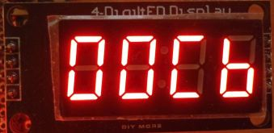
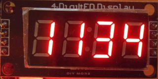
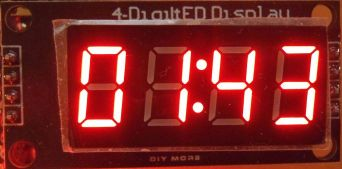
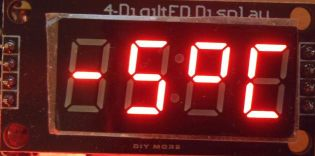
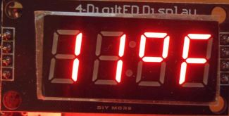
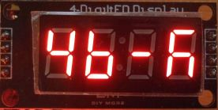
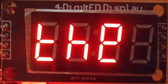
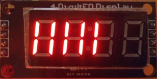

# AceSegmentWriter

[](https://github.com/bxparks/AceSegmentWriter/actions/workflows/aunit_tests.yml)

A companion library to the [AceSegment](https://github.com/bxparks/AceSegment)
library. This provides higher-level convenience classes for writing decimal
numbers, hex numbers, temperature, clock digits, characters, and strings to
seven segment LED modules. The following classes are provided: `PatternWriter`,
`NumberWriter`, `ClockWriter`, `TemperatureWriter`, `CharWriter`,
`StringWriter`, `LevelWriter`, and `StringScroller`.

Initially, this code was part of the AceSegment library and depended directly on
the `LedModule` class of that library. Later the direct dependency was removed
by converting the Writer classes into generic code using C++ templates. The
classes now depend on the `T_LED_MODULE` template type which should implement
the public methods that appear in the `LedModule` class. But `T_LED_MODULE` is
*not* required to inherit from `LedModule` which preserves the decoupling
between the AceSegmentWriter and AceSegment libraries.

**Version**: 0.3 (2022-02-02)

**Changelog**: [CHANGELOG.md](CHANGELOG.md)

## Table of Contents

* [Installation](#Installation)
    * [Source Code](#SourceCode)
    * [Dependencies](#Dependencies)
* [Documentation](#Documentation)
    * [Examples](#Examples)
* [High Level Overview](#HighLevelOverview)
    * [Classes and Types](#ClassesAndTypes)
    * [Dependency Diagram](#DependencyDiagram)
    * [Digit and Segment Addressing](#DigitAndSegmentAddressing)
* [Usage](#Usage)
    * [Include Header and Namespace](#HeaderAndNamespace)
    * [T_LED_MODULE](#T_LED_MODULE)
    * [PatternWriter](#PatternWriter)
    * [NumberWriter](#NumberWriter)
    * [ClockWriter](#ClockWriter)
    * [TemperatureWriter](#TemperatureWriter)
    * [CharWriter](#CharWriter)
    * [StringWriter](#StringWriter)
    * [LevelWriter](#LevelWriter)
    * [StringScroller](#StringScroller)
* [Resource Consumption](#ResourceConsumption)
    * [Flash And Static Memory](#FlashAndStaticMemory)
* [System Requirements](#SystemRequirements)
    * [Hardware](#Hardware)
    * [Tool Chain](#ToolChain)
    * [Operating System](#OperatingSystem)
* [Bugs And Limitations](#BugsAndLimitations)
* [Alternative Libraries](#AlternativeLibraries)
* [License](#License)
* [Feedback and Support](#FeedbackAndSupport)
* [Authors](#Authors)

<a name="Installation"></a>
## Installation

The latest stable release is available in the Arduino IDE Library Manager.
Search for "AceSegmentWriter". Click install.

The development version can be installed by cloning the [GitHub
repository](https://github.com/bxparks/AceSegmentWriter), checking out the
default `develop` branch, then manually copying over to or symlinking from the
`./libraries` directory used by the Arduino IDE. (The result is a directory or
link named `./libraries/AceSegmentWriter`.)

The `master` branch contains the stable releases.

<a name="SourceCode"></a>
### Source Code

The source files are organized as follows:
* `src/AceSegmentWriter.h` - main header file
* `src/ace_segment_writer/` - implementation files
* `tests/` - unit tests which require [AUnit](https://github.com/bxparks/AUnit)
* `examples/` - example sketches
* `docs/` - contains the doxygen docs and additional manual docs

<a name="Dependencies"></a>
### Dependencies

This library library has a direct, compile-time dependency on:

* AceCommon (https://github.com/bxparks/AceCommon)

The following libraries are recommended, and they are added in the `depends`
property of `library.properties` so that they are automatically installed by the
Arduino Library Manager for convenience. However, client applications are not
*required* to use these. Other libraries with the same interface and
functionality can be substituted if desired.

* AceSegment (https://github.com/bxparks/AceSegment)
* AceSPI (https://github.com/bxparks/AceSPI)
* AceTMI (https://github.com/bxparks/AceTMI)
* AceWire (https://github.com/bxparks/AceWire)

The unit tests depend on:

* AUnit (https://github.com/bxparks/AUnit)

Some of the examples may depend on the following which may need to be installed
manually:

* AceButton (https://github.com/bxparks/AceButton)

<a name="Documentation"></a>
## Documentation

* this `README.md` file
* [Doxygen docs](https://bxparks.github.io/AceSegmentWriter/html)
    * On Github pages.

<a name="Examples"></a>
### Examples

The following example sketches are provided:

* Basic
    * All of the examples assume an LED module based on the TM1637 controller
      chip. These LED modules are readily found on retail outlets like eBay or
      Amazon. You can reconfigure the examples to use a different LED module.
    * [PatternWriterDemo](examples/PatternWriterDemo)
    * [NumberWriterDemo](examples/NumberWriterDemo)
    * [ClockWriterDemo](examples/ClockWriterDemo)
    * [TemperatureWriterDemo](examples/TemperatureWriterDemo)
    * [CharWriterDemo](examples/CharWriterDemo)
    * [StringWriterDemo](examples/StringWriterDemo)
    * [LevelWriterDemo](examples/LevelWriterDemo)
    * [StringScrollerDemo](examples/StringScrollerDemo)
* Intermediate
    * [WriterTester](examples/WriterTester)
        * demo of the various `src/writer` classes
        * supports multiple LED modules based on different controller chips
          though `#define` macros
        * depends on AceButton (https://github.com/bxparks/AceButton) library
        * uses 2 buttons for "single step" debugging mode
* Benchmarks
    * [MemoryBenchmark](examples/MemoryBenchmark): determines the size of
      the various components of the library
    * No `AutoBenchmark` program.
        * These Writer classes simply write into the in-memory buffer provided
          by the underying `T_LED_MODULE` class.
        * The execution time is too fast to be easily measured and does not seem
          worth the effort.

<a name="HighLevelOverview"></a>
## High Level Overview

<a name="ClassesAndTypes"></a>
### Classes and Types

Here are the classes and types in the library:

* `T_LED_MODULE`
    * Generic type for classes in this library. It is assumed to implement the
      public methods of the `LedModule` class of the AceSegment library.
* `PatternWriter`
    * Class that knows how to write segment bit patterns to a `T_LED_MODULE`.
    * Other Writer classes are built upon this by composition.
* `NumberWriter`
    * A class that writes integers in decimal or hexadecimal format to the
      `T_LED_MODULE`.
    * A few additional characters are supported: `kDigitSpace`, `kDigitMinus`
* `ClockWriter`
    * A class that writes a clock string "hh:mm" to `T_LED_MODULE`.
    * Builds on top of `NumberWriter`.
* `TemperatureWriter`
    * A class that writes temperatures with a degrees symbol or optionally
      with "C" or "F" symbol.
    * Builds on top of `NumberWriter`.
* `CharWriter`
    * A class that convert an ASCII character represented by a `char` (code
      0-127) to a bit pattern used by `SegmentDriver` class.
    * Not all ASCII characters can be rendered on a seven segment display
      legibly but the `CharWriter` tries its best.
* `StringWriter`
    * A class that prints strings of `char` to a `CharWriter`, which in
      turns, prints to the `T_LED_MODULE`.
    * Builds on top of `CharWriter`.
* `StringScoller`
    * Scroll a string left and right.
* `LevelWriter`
    * Display specified number of bars from left to right, 2 bars per digit.

<a name="DependencyDiagram"></a>
### Dependency Diagram

The conceptual dependency diagram among these classes looks something like this:

```
StringScroller StringWriter  ClockWriter TemperatureWriter
            \       /             \      /
             v     v               v    v
             CharWriter        NumberWriter      LevelWriter
                      \             |             /
                       v            v            v
                       PatternWriter<T_LED_MODULE>
                                |
                                v
                           T_LED_MODULE
                                |
                                | (depends on AceSegment if
                                | T_LED_MODULE is set to LedModule)
                                v
                            AceSegment
                            Library
                           /    |     \
                          v     v      v
                    AceWire  AceTMI   AceSPI
                    Library  Library  Library
```

<a name="DigitAndSegmentAddressing"></a>
### Digit and Segment Addressing

The `T_LED_MODULE` type must support the same conventions for addressing
the digits and segments as defined by the AceSegment library:

* digits start at position 0 on the left and increase to the right
* segments are assigned bits 0 to 7 of an unsigned byte (type `uint8_t`) with
  segment `a` assigned to bit 0, segment `g` assigned to bit 6, and the optional
  decimal point assigned to bit 7

```
+------------+  +------------+           +------------+
|   aaaa     |  |   aaaa     |           |   aaaa     |
|  f    b    |  |  f    b    |           |  f    b    |
|  f    b    |  |  f    b    |           |  f    b    |
|   gggg     |  |   gggg     |  *  *  *  |   gggg     |
|  e    c    |  |  e    c    |           |  e    c    |
|  e    c    |  |  e    c    |           |  e    c    |
|   dddd  dp |  |   dddd  dp |           |   dddd  dp |
+------------+  +------------+           +------------+
  Digit 0         Digit 1                 Digit {N-1}


Segment: dp g f e d c b a
   Bit:  7  6 5 4 3 2 1 0
```

Some 4-digit LED modules are designed to be used in a clock to display the hour
and minute components of the time as `HH:MM`. In these modules, it is common for
the decimal point on Digit 1 to be replaced with the `colon` segment between
Digit 1 and Digit 2. In these modules, sometimes the decimal points for the
other digits work normally, but sometimes, the remaining decimal points do not
work at all.

<a name="Usage"></a>
## Usage

<a name="HeaderAndNamespace"></a>
### Include Header and Namespace

Only a single header file `AceSegmentWriter.h` is required to use this library.
To prevent name clashes with other libraries that the calling code may use, all
classes are defined in the `ace_segment` namespace. (This is the same namespace
used by the AceSegment library to make it easier to use them together.) To use
the code without prepending the `ace_segment::` prefix, use the `using`
directive:

```C++
#include <Arduino.h>
#include <AceSegmentWriter.h>
using namespace ace_segment;
```

<a name="T_LED_MODULE"></a>
### `T_LED_MODULE`

All Writer classes directly (or indirectly) wrap around an underlying LED module
class with the generic `T_LED_MODULE` type. It is assumed to implement the same
public methods of the
[LedModule](https://github.com/bxparks/AceSegment/blob/develop/src/ace_segment/LedModule.h)
class from AceSegment. However, the Writer classes in this library are
implemented as C++ templates, so the `T_LED_MODULE` type does **not** need to
inherit from the `LedModule` class. The public methods of `T_LED_MODULE`
should look like this:

```C++
class LedModule {
  public:
    uint8_t size() const;
    void setPatternAt(uint8_t pos, uint8_t pattern);
    uint8_t getPatternAt(uint8_t pos) const;
    void setBrightness(uint8_t brightness);
    void getBrightness() const;
    void setDecimalPointAt(uint8_t pos, bool state = true);
};
```

<a name="PatternWriter"></a>
### PatternWriter

The `PatternWriter` class is the most basic wrapper around an `T_LED_MODULE`
object, and provides more convenient interfaces to writing to the LED module. It
provides the following features on top of `T_LED_MODULE`:

* Validation is performed on the digit `pos` parameter. If the `pos` is not
  valid, then the method returns immediately without performing any action.
* Entire strings (both normal strings and `PROGMEM` strings) can be written
  to the led module.
* The `setDecimalPointAt()` convenience function adds a decimal point at the
  specified `pos` location.
* The `clear()` and `clearToEnd()` functions provide ways to clear the LED
  display.
* A stateful cursor that remembers its current `pos` digit in the `LedModule`.

All other `XxxWriter` classes are built on top of this class. If multiple
writers are used in an application (which happens often because each Writer is
responsible for writing different things), the application should make sure that
only a single instance of `PatternWriter` is created. Otherwise, the "current"
position may become confusing.

The public methods and constants of the class look like this:

```C++
namespace ace_segment {

const uint8_t kPattern0 = 0b00111111;
const uint8_t kPattern1 = 0b00000110;
const uint8_t kPattern2 = 0b01011011;
const uint8_t kPattern3 = 0b01001111;
const uint8_t kPattern4 = 0b01100110;
const uint8_t kPattern5 = 0b01101101;
const uint8_t kPattern6 = 0b01111101;
const uint8_t kPattern7 = 0b00000111;
const uint8_t kPattern8 = 0b01111111;
const uint8_t kPattern9 = 0b01101111;
const uint8_t kPatternA = 0b01110111;
const uint8_t kPatternB = 0b01111100;
const uint8_t kPatternC = 0b00111001;
const uint8_t kPatternD = 0b01011110;
const uint8_t kPatternE = 0b01111001;
const uint8_t kPatternF = 0b01110001;
const uint8_t kPatternSpace = 0b00000000;
const uint8_t kPatternMinus = 0b01000000;
const uint8_t kPatternDeg = 0b01100011;
const uint8_t kPatternP = 0b01110011;

template <typename T_LED_MODULE>
class PatternWriter {
  public:
    explicit PatternWriter(T_LED_MODULE& ledModule);

    T_LED_MODULE& ledModule() const;

    uint8_t size() const;
    void home();
    uint8_t pos() const;
    void pos(uint8_t pos);

    void writePattern(uint8_t pattern);
    void writePatterns(const uint8_t patterns[], uint8_t len);
    void writePatterns_P(const uint8_t patterns[], uint8_t len);
    void setDecimalPointAt(uint8_t pos, bool state = true);

    void clear();
    void clearToEnd();
};

}
```

The `writePattern()` function writes the given `pattern` at the current `pos`.
The `pos` is automatically incremented by one.

The `pos()` function sets or gets the current position.

The `home()` function sets the current position to 0.

The `clear()` function clears all the digits of the `ledModule`. The
`clearToEnd()` clears only the digits from the current position to the end. In
both cases, the `home()` function is automatically called to set the position to
0.

The decimal point is stored as bit 7 (the most significant bit) of the `uint8_t`
byte for a given digit. This bit is cleared by the other `writePattern()` or
`writePatterns()` functions. So the `setDecimalPointAt()` method should be
called **after** the other write methods are called.

Here is how to create an instance of `PatternWriter` from an instance of
`LedModule`:

```C++
PatternWriter<LedModule> patternWriter(ledModule);
```

<a name="NumberWriter"></a>
### NumberWriter

The `NumberWriter` can print integers to the `T_LED_MODULE` using decimal (0-9)
or hexadecimal (0-9A-F) formats. On platforms that support it (AVR and ESP8266),
the bit mapping table is stored in flash memory to conserve static memory.

The public methods of this class looks something like this:

```C++
namespace ace_segment {

const uint8_t kNumDigitPatterns = 18;
extern const uint8_t kDigitPatterns[kNumDigitPatterns];

typedef uint8_t digit_t;
const digit_t kDigitSpace = 0x10;
const digit_t kDigitMinus = 0x11;

template <typename T_LED_MODULE>
class NumberWriter {
  public:
    explicit NumberWriter(PatternWriter<T_LED_MODULE>& ledModule);

    T_LED_MODULE& ledModule();
    PatternWriter<T_LED_MODULE>& patternWriter();

    uint8_t size() const;
    void home();

    void writeDigit(digit_t c);
    void writeDigits(digit_t s[], uint8_t len);

    void writeDec2(uint8_t d, uint8_t padPattern = kPattern0);
    void writeDec4(uint16_t dd, uint8_t padPattern = kPattern0);

    void writeBcd(uint8_t bcd);
    void writeHexByte(uint8_t b);
    void writeHexWord(uint16_t w);

    void writeUnsignedDecimal(uint16_t num, int8_t boxSize = 0);
    void writeSignedDecimal(int16_t num, int8_t boxSize = 0);

    void setDecimalPointAt(uint8_t pos, bool state = true);

    void clear();
    void clearToEnd(uint8_t pos);
};

}
```

The `digit_t` type semantically represents the character set supported by this
class. It is implemented as an alias for `uint8_t`, which unfortunately means
that the C++ compiler will not warn about mixing this type with another
`uint8_t`. The range of this character set is from `[0,15]` plus 2 additional
symbols, so `[0,17]`:

* `ace_segment::kDigitSpace`
* `ace_segment::kDigitMinus`

An instance of `NumberWriter` is created like this:

```C++
PatternWriter<LedModule> patternWriter(ledModule);
NumberWriter<LedModule> numberWriter(patternWriter);
```





<a name="ClockWriter"></a>
### ClockWriter

There are special, 4 digit,  seven segment LED displays which replace the
decimal point with the colon symbol ":" between the 2 digits on either side so
that it can display a time in the format "hh:mm".

The public methods of this class look like this:

```C++
namespace ace_segment {

template <typename T_LED_MODULE>
class ClockWriter {
  public:
    explicit ClockWriter(
        NumberWriter<T_LED_MODULE>& numberWriter,
        uint8_t colonDigit = 1);

    T_LED_MODULE& ledModule();
    PatternWriter<T_LED_MODULE>& patternWriter();
    NumberWriter<T_LED_MODULE>& numberWriter();

    uint8_t size() const;
    void home();

    void writeHourMinute24(uint8_t hh, uint8_t mm);
    void writeHourMinute12(uint8_t hh, uint8_t mm);
    void writeColon(bool state = true);

    void clear();
    void clearToEnd(
};

}
```

An instance of `ClockWriter` is created like this:

```C++
PatternWriter<LedModule> patternWriter(ledModule);
NumberWriter<LedModule> numberWriter(patternWriter);
ClockWriter<LedModule> clockWriter(numberWriter);
```

You can write the letters `A` and `P` using the underlying `patternWriter()`:

```
clockWriter.patternWriter().writePattern(ace_segment::kPatternA);
```



<a name="TemperatureWriter"></a>
### TemperatureWriter

This class supports writing out temperatures in degrees Celsius or Fahrenheit.
The public methods of this class looks something like this:

```C++
namespace ace_segment {

const uint8_t kPatternDegree = 0b01100011;
const uint8_t kPatternC = 0b00111001;
const uint8_t kPatternF = 0b01110001;

template <typename T_LED_MODULE>
class TemperatureWriter {
  public:
    explicit TemperatureWriter(NumberWriter<T_LED_MODULE>& numberWriter);

    T_LED_MODULE& ledModule();
    PatternWriter<T_LED_MODULE>& patternWriter();
    NumberWriter<T_LED_MODULE>& numberWriter();

    uint8_t size() const;
    void home();

    uint8_t writeTemp(int16_t temp, boxSize = 0);
    uint8_t writeTempDeg(int16_t temp, boxSize = 0);
    uint8_t writeTempDegC(int16_t temp, boxSize = 0);
    uint8_t writeTempDegF(int16_t temp, boxSize = 0);

    void clear();
    void clearToEnd();
};

}
```

An instance of `TemperatureWriter` is created like this:

```C++
PatternWriter<LedModule> patternWriter(ledModule);
NumberWriter<LedModule> numberWriter(patternWriter);
TemperatureWriter<LedModule> temperatureWriter(numberWriter);
```





<a name="CharWriter"></a>
### CharWriter

It is possible to represent many of the ASCII characters in the range `[0,127]`
on a seven-segment LED display, although some of the characters will necessarily
be crude given the limited number of segments. The `CharWriter` contains a
[mapping of ASCII](https://github.com/dmadison/LED-Segment-ASCII) characters
to seven-segment bit patterns. On platforms that support it (AVR and
ESP8266), the bit pattern array is stored in flash memory to conserve static
memory.

The public methods of this class look like this:

```C++
namespace ace_segment {

const uint8_t kPatternUnknown = 0b00000000;

const uint8_t kNumCharPatterns = 128;
extern const uint8_t kCharPatterns[kNumCharPatterns];

template <typename T_LED_MODULE>
class CharWriter {
  public:
    explicit CharWriter(
        PatternWriter<T_LED_MODULE>& patternWriter,
        const uint8_t charPatterns[] = kCharPatterns,
        uint8_t numChars = kNumChars
    );

    T_LED_MODULE& ledModule();
    PatternWriter<T_LED_MODULE>& patternWriter();

    uint8_t getNumChars() const;
    uint8_t getPattern(char c) const;

    uint8_t size() const;
    void home();

    void writeChar(uint8_t pos, char c);
    void setDecimalPointAt(uint8_t pos, bool state = true);

    void clear();
    void clearToEnd();
};

}
```

An instance of `CharWriter` is created like this:

```C++
PatternWriter<LedModule> patternWriter(ledModule);
CharWriter<LedModule> charWriter(patternWriter);
```

You can use a custom font by providing an array of segment bit patterns
`patterns[]` in the constructor of `CharWriter`.



<a name="StringWriter"></a>
### StringWriter

A `StringWriter` is a class that builds on top of the `CharWriter`. It knows how
to write entire strings into the LED display. The public methods look like:

```C++
template <typename T_LED_MODULE>
class StringWriter {
  public:
    explicit StringWriter(CharWriter<T_LED_MODULE>& charWriter);

    T_LED_MODULE& ledModule();
    PatternWriter<T_LED_MODULE>& patternWriter();
    CharWriter<T_LED_MODULE>& charWriter();

    uint8_t size() const;
    void home();

    uint8_t writeString(const char* cs, uint8_t numChar = 255);
    uint8_t writeString(const __FlashStringHelper* fs, uint8_t numChar = 255);

    void clear();
    void clearToEnd();
};
```

The implementation of `writeString()` is straightforward except for the
handling of a decimal point. A seven segment LED digit contains a small LED for
the decimal point. Instead of taking up an entire digit for a single '.'
character, we can collapse the '.' character into the decimal point indicator of
the previous character on the left.

The optional `numChar` parameter limits the number of characters in the string
to write. The default value is 255 which is expected to be larger than the
largest LED module that will be used with the AceSegment and AceSegmentWriter
libraries, so the default value will print the entire string.

The actual number of LED digits written is returned by `writeString()`. For
example, writing `"1.2"` returns 2 because the decimal point was merged into the
previous digit and only 2 digits are written.

The `clearToEnd()` method clears the LED display from the current `pos` to the
end of the display.

An instance of `StringWriter` is created like this:

```C++
PatternWriter<LedModule> patternWriter(ledModule);
CharWriter<LedModule> charWriter(patternWriter);
StringWriter<LedModule> stringWriter(charWriter);
```

The following will write the given string and clear all digits after the end of
the string:

```
stringWriter.writeString(s);
stringWriter.clearToEnd();
```



<a name="LevelWriter"></a>
### LevelWriter

A `LevelWriter` writes a specified number of vertical bars (2 vertical
bar per digit) to the LED display, emulating a level meter LED module.

```C++
namespace ace_segment {

const uint8_t kPatternLevelLeft = 0b00110000;
const uint8_t kPatternLevelRight = 0b00000110;

template <typename T_LED_MODULE>
class LevelWriter {
  public:
    explicit LevelWriter(PatternWriter<T_LED_MODULE>& patternWriter);

    T_LED_MODULE& ledModule();
    PatternWriter<T_LED_MODULE>& patternWriter();

    uint8_t getMaxLevel() const;
    void writeLevel(uint8_t level);
};

}
```

An instance of `LevelWriter` is created like this:

```C++
PatternWriter<LedModule> patternWriter(ledModule);
LevelWriter<LedModule> levelWriter(patternWriter);
```

There are 2 vertical bars available per per digit. So the maximum level
supported by a 4-digit LED module is 8, and an 8-digit LED module supports a
maximum level of 16.



<a name="StringScroller"></a>
### StringScroller

A `StringScroller` is a class that builds on top of the `CharWriter`. It can
scroll strings to the left and right. The public methods look like:

```C++
namespace ace_segment {

template <typename T_LED_MODULE>
class StringScroller {
  public:
    explicit StringScroller(CharWriter<T_LED_MODULE>& charWriter);

    T_LED_MODULE& ledModule();
    PatternWriter<T_LED_MODULE>& patternWriter();
    CharWriter<T_LED_MODULE>& charWriter();

    uint8_t size() const;

    void initScrollLeft(const char* s);
    void initScrollLeft(const __FlashStringHelper* s);
    bool scrollLeft();

    void initScrollRight(const char* s);
    void initScrollRight(const __FlashStringHelper* s);
    bool scrollRight();
};

}
```

An instance of `StringScroller` is built from its underlying classes like this:

```C++
PatternWriter<LedModule> patternWriter(ledModule);
CharWriter<LedModule> charWriter(patternWriter);
StringScroller<LedModule> stringScroller(charWriter);
```

To scroll a string to the left, initialize the string using `initScrollLeft()`,
then call `scrollLeft()` to shift one position to the left. The string scrolls
into the first digit on the right. When the scrolling is finished, the display
becomes blank, and the `scrollLeft()` method returns `true` to indicate
`isDone`.

Similarly to scroll to the right, initialize the string using
`initScrollRight()`, then call `scrollRight()` to shift to the right. The string
scrolls into the first digit on the left. When the scrolling is finished, the
display becomes blank, and the `scrollRight()` method returns `true` to indicate
`isDone`.

<a name="ResourceConsumption"></a>
## Resource Consumption

<a name="FlashAndStaticMemory"></a>
### Flash And Static Memory

For the most part, the user pays only for the feature that is being used. For
example, if the `CharWriter` (which consumes about 300 bytes of flash on AVR) is
not used, it is not loaded into the program.

The full details are given in
[examples/MemoryBenchmark](examples/MemoryBenchmark). Here are 2 samples of
the flash and static memory consumptions.

**Arduino Nano (ATmega328)**

```
+--------------------------------------------------------------+
| functionality                   |  flash/  ram |       delta |
|---------------------------------+--------------+-------------|
| baseline                        |    470/   11 |     0/    0 |
|---------------------------------+--------------+-------------|
| PatternWriter                   |    548/   18 |    78/    7 |
| NumberWriter                    |    720/   18 |   250/    7 |
| ClockWriter                     |    748/   19 |   278/    8 |
| TemperatureWriter               |    906/   18 |   436/    7 |
| CharWriter                      |    716/   21 |   246/   10 |
| StringWriter                    |    838/   23 |   368/   12 |
| StringScroller                  |    916/   29 |   446/   18 |
| LevelWriter                     |    634/   18 |   164/    7 |
+--------------------------------------------------------------+
```

**ESP8266**

```
+--------------------------------------------------------------+
| functionality                   |  flash/  ram |       delta |
|---------------------------------+--------------+-------------|
| baseline                        | 260121/27900 |     0/    0 |
|---------------------------------+--------------+-------------|
| PatternWriter                   | 260157/27912 |    36/   12 |
| NumberWriter                    | 260381/27912 |   260/   12 |
| ClockWriter                     | 260445/27912 |   324/   12 |
| TemperatureWriter               | 260525/27912 |   404/   12 |
| CharWriter                      | 260333/27920 |   212/   20 |
| StringWriter                    | 260517/27920 |   396/   20 |
| StringScroller                  | 260501/27928 |   380/   28 |
| LevelWriter                     | 260221/27912 |   100/   12 |
+--------------------------------------------------------------+
```

<a name="SystemRequirements"></a>
## System Requirements

<a name="Hardware"></a>
### Hardware

**Tier 1: Fully Supported**

* Arduino Nano (16 MHz ATmega328P)
* SparkFun Pro Micro (16 MHz ATmega32U4)
* STM32 Blue Pill (STM32F103C8, 72 MHz ARM Cortex-M3)
* NodeMCU 1.0 (ESP-12E module, 80MHz ESP8266)
* WeMos D1 Mini (ESP-12E module, 80 MHz ESP8266)
* ESP32 dev board (ESP-WROOM-32 module, 240 MHz dual core Tensilica LX6)
* Teensy 3.2 (72 MHz ARM Cortex-M4)

**Tier 2: Should work**

These boards should work but I don't test them as often:

* ATtiny85 (8 MHz ATtiny85)
* Arduino Pro Mini (16 MHz ATmega328P)
* Teensy LC (48 MHz ARM Cortex-M0+)
* Mini Mega 2560 (Arduino Mega 2560 compatible, 16 MHz ATmega2560)

**Tier 3: May work, but not supported**

* SAMD21 M0 Mini (48 MHz ARM Cortex-M0+)
    * Arduino-branded SAMD21 boards use the ArduinoCore-API, so are explicitly
      blacklisted. See below.
    * Other 3rd party SAMD21 boards *may* work using the SparkFun SAMD core.
    * However, as of SparkFun SAMD Core v1.8.6 and Arduino IDE 1.8.19, I can no
      longer upload binaries to these 3rd party boards due to errors.
    * Therefore, third party SAMD21 boards are now in this new Tier 3 category.
    * This library may work on these boards, but I can no longer support them.

**Tier Blacklisted**

The following boards are *not* supported and are explicitly blacklisted to allow
the compiler to print useful error messages instead of hundreds of lines of
compiler errors:

* Any platform using the ArduinoCore-API
  (https://github.com/arduino/ArduinoCore-api).
    * For example, Nano Every, MKRZero, and Raspberry Pi Pico RP2040.

<a name="ToolChain"></a>
### Tool Chain

* [Arduino IDE 1.8.19](https://www.arduino.cc/en/Main/Software)
* [Arduino CLI 0.19.2](https://arduino.github.io/arduino-cli)
* [SpenceKonde ATTinyCore 1.5.2](https://github.com/SpenceKonde/ATTinyCore)
* [Arduino AVR Boards 1.8.4](https://github.com/arduino/ArduinoCore-avr)
* [Arduino SAMD Boards 1.8.9](https://github.com/arduino/ArduinoCore-samd)
* [SparkFun AVR Boards 1.1.13](https://github.com/sparkfun/Arduino_Boards)
* [SparkFun SAMD Boards 1.8.6](https://github.com/sparkfun/Arduino_Boards)
* [STM32duino 2.2.0](https://github.com/stm32duino/Arduino_Core_STM32)
* [ESP8266 Arduino 3.0.2](https://github.com/esp8266/Arduino)
* [ESP32 Arduino 2.0.2](https://github.com/espressif/arduino-esp32)
* [Teensyduino 1.56](https://www.pjrc.com/teensy/td_download.html)

This library is *not* compatible with:

* Any platform using the
  [ArduinoCore-API](https://github.com/arduino/ArduinoCore-api), for example:
    * [Arduino megaAVR](https://github.com/arduino/ArduinoCore-megaavr/)
    * [MegaCoreX](https://github.com/MCUdude/MegaCoreX)
    * [Arduino SAMD Boards >=1.8.10](https://github.com/arduino/ArduinoCore-samd)

It should work with [PlatformIO](https://platformio.org/) but I have
not tested it.

The library can be compiled under Linux or MacOS (using both g++ and clang++
compilers) using the EpoxyDuino (https://github.com/bxparks/EpoxyDuino)
emulation layer.

<a name="OperatingSystem"></a>
### Operating System

I use Ubuntu 20.04 for the vast majority of my development. I expect that the
library will work fine under MacOS and Windows, but I have not explicitly tested
them.

<a name="BugsAndLimitations"></a>
## Bugs and Limitations

* The `NumberWriter` class does not support floating point numbers.
    * The primary reason is that I almost never use floating point numbers on
      embedded microcontrollers. Most embedded processors do not have hardware
      FPU, so floating point operations are implemented using software, which
      consumes significant amounts of memory and CPU cycles.
    * The second reason is that floating point formatting is very complex. There
      are numerous options to consider. For example: left justified, right
      justified, left pad with space, left padding with zeros, right padding
      with space, right padding with zeros, specifying the number of digits
      after the decimal point, and formating using scientific notation.
    * With so many different formatting options to consider, the easiest
      solution might be to defer this problem to the `vsnprintf()` function, to
      convert a float to a string, then render that string on the LED module.
      Except that on 8-bit AVR processors, the `vnsprintf()` function does not
      support floating point numbers.
    * The other potential solution is to use the `Print::print()` function to
      print a float to a string buffer, such as the `PrintStr<N>` class in
      [AceCommon](https://github.com/bxparks/AceCommon), then print the string
      to the LED module. This might be the most practical solution on an Arduino
      platform.
    * In any case, I think the code for printing floating point numbers should
      not go into the `NumberWriter` class, but into a new class called
      something like `FloatWriter`. The `FloatWriter` class could pull in a
      `NumberWriter` object and build on top of it.

<a name="AlternativeLibraries"></a>
## Alternative Libraries

Tracked using [AceSegment Wiki](https://github.com/bxparks/AceSegment/wiki).

<a name="License"></a>
## License

[MIT License](https://opensource.org/licenses/MIT)

<a name="FeedbackAndSupport"></a>
## Feedback and Support

If you have any questions, comments, or feature requests for this library,
please use the [GitHub
Discussions](https://github.com/bxparks/AceSegmentWriter/discussions) for this
project. If you have bug reports, please file a ticket in [GitHub
Issues](https://github.com/bxparks/AceSegmentWriter/issues). Feature requests
should go into Discussions first because they often have alternative solutions
which are useful to remain visible, instead of disappearing from the default
view of the Issue tracker after the ticket is closed.

Please refrain from emailing me directly unless the content is sensitive. The
problem with email is that I cannot reference the email conversation when other
people ask similar questions later.

<a name="Authors"></a>
## Authors

Created by Brian T. Park (brian@xparks.net).
